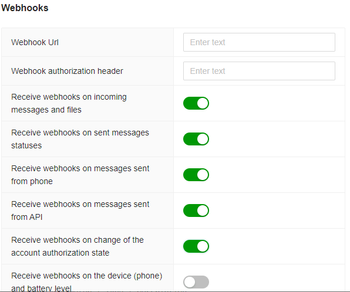

# Receive webhooks via HTTP API

You can get incoming webhooks (messages, statuses) via HTTP API requests in the similar way as the rest of the Green API methods are implemented. Herewith, the chronological order of the webhooks following is guaranteed in the sequence in which they were received [FIFO](https://ru.wikipedia.org/wiki/FIFO). All incoming webhooks are stored in the queue and are expected to be received within 24 hours.

To get incoming webhooks, you have to sequentially call two methods [ReceiveNotification](technology-http-api/ReceiveNotification.md) and [DeleteNotification](technology-http-api/DeleteNotification.md). [ReceiveNotification](technology-http-api/ReceiveNotification.md) method receives an incoming webhook. [DeleteNotification](technology-http-api/DeleteNotification.md) method confirms successful webhook receipt and processing. To learn more about the methods, refer to respective [ReceiveNotification](technology-http-api/ReceiveNotification.md) and [DeleteNotification](technology-http-api/DeleteNotification.md) sections.

> Incoming webhooks are stored for 24 hours.

## Account setup

Before receiving incoming webhooks, you need to set up your account. Account settings can be performed [in software](#SetSettings) using [SetSettings](../account/SetSettings.md) method, or [online](#cabinet) in your profile interface.

### Setup by [SetSettings](../account/SetSettings.md) {#SetSettings} method

To set up receiving incoming webhooks using HTTP API technology, you need to specify the below value as `webhookUrl` parameter:

```
https://webhook.green-api.com
```

It is also required to specify what types of webhooks you need to receive. To enable incoming webhooks by type, as well as to specify `webhookUrl` parameter, use [SetSettings](../account/SetSettings.md) method.

#### Example of [SetSettings](../account/SetSettings.md) method request body

```json
{
    "webhookUrl": "https://webhook.green-api.com",
    "outgoingWebhook": "yes",
    "stateWebhook": "yes",
    "incomingWebhook": "yes",
    "deviceWebhook": "no"
}
```

### Setup in your profile {#cabinet}

You can also set up to receive incoming webhooks online. To do this, go to [Your profile](https://cabinet.green-api.com) and select the required user account. If the account is authorized, the settings for receiving incoming webhooks will be displayed, see fig. Specify the `webhookUrl` parameter, as well as the switches by webhooks types. f the account is not authorized and the webhooks settings are not displayed, refer to [Before you start](../../before-start.md#qr) section.



## Receive incoming webhooks

After setting up the account, you can start receiving webhooks by [ReceiveNotification](technology-http-api/ReceiveNotification.md) and [DeleteNotification](technology-http-api/DeleteNotification.md) methods. You can see the example of incoming webhook processing code on [NodeJS](https://nodejs.org) in [ReceiveNotifications](https://github.com/green-api/whatsapp-api-client/blob/master/examples/ReceiveNotifications.js) file.

A detailed description of incoming webhooks format is given in [Incoming webhooks format](notifications-format/index.md).
