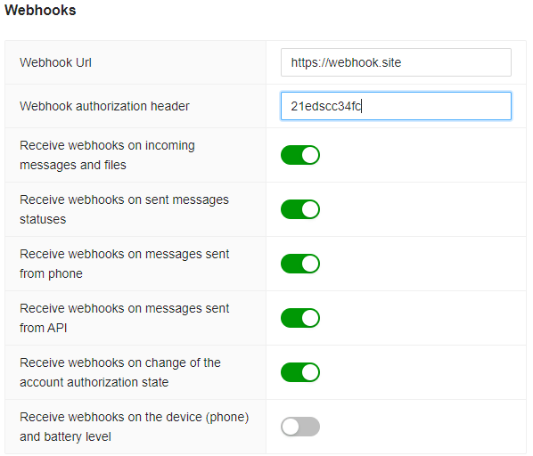

# Получение уведомлений через Webhook Endpoint

Технология Webhook Endpoint позволяет выполнять получение входящих уведомлений непосредственно на ваш сервер. Это означает, что сервер Green API будет выполнять вызов метода, опубликованного на стороне вашего сервера. Преимуществами данной технологии является максимально быстрое получение входящих уведомлений и высокая пропускная способность, ограниченная только скоростью обработки уведомлений на стороне вашего сервера. К недостаткам можно отнести сложность реализации. 

> Сервер Green API выполняет 5 попыток доставки уведомлений с увеличенным интервалом. Поэтому, настраивайте свой сервер таким образом, чтобы он всегда был доступен для обработки входящих уведомлений, либо воспользуйтесь технологией [Получение уведомлений через HTTP API](technology-http-api.md), в которой доставка входящих уведомлений гарантируется в течение 24 часов.

## Server setting
Для получения входящих уведомлений по технологии Webhook Endpoint потребуется выполнить следующие шаги:

- to publish the IP address on the internet
- реализовать логику обработки входящих уведомлений на указанный IP-адрес
- если тебуется для сервера, то установить Webhook URL Token

### Public IP address

To receive incoming webhooks, a public IP address (endpoint) is required, which will be accessible from the Internet. Thus, the Green API server will be able to make a call to your server at the specified address and transmit an incoming webhook.

### Incoming webhooks processing

After receiving an incoming call to the IP address of your server, you will need to process the received webhook. You can see the example of incoming webhook processing code on [NodeJS](https://nodejs.org) in [file](https://github.com/green-api/whatsapp-api-client/blob/master/examples/ReceiveWebhook.js)

## Account setup {#webhookUrl}

Before receiving incoming webhooks, you need to set up your account. Account settings can be performed [in software](# SetSettings) using [SetSettings](../account/SetSettings.md) method, or [online](#cabinet) in your profile interface.

### Setting by [SetSettings](../account/SetSettings.md) {#SetSettings} method

To set up receiving incoming webhooks using Webhook Endpoint technology, you need to specify your IP address or your domain name as the `webhookUrl` parameter, and, if necessary,` webhookUrlToken` to access your server. For example:

```
https://84.211.100.201:3000/green-api/webhook/
```

It is also required to specify what types of webhooks you need to receive. To enable incoming webhooks by type, as well as to specify `webhookUrl` and` webhookUrlToken` parameters, use [SetSettings](../account/SetSettings.md) method.

#### Example of [SetSettings](../account/SetSettings.md) method request body

```json
{
    "webhookUrl": "https://84.211.100.201:3000/green-api/webhook/",
    "webhookUrlToken": "dscnsdiuafkascndjhsalbcvatsvcbasn23rfregvfdg54tds",
    "outgoingWebhook": "yes",
    "stateWebhook": "yes",
    "incomingWebhook": "yes",
    "deviceWebhook": "no"
}
```

### Setting up in your profile {#cabinet}

You can also set up to receive incoming webhooks online. To do this, go to [My Profile](https://cabinet.green-api.com) and select the required account. If the account is authorized, the settings for receiving incoming webhooks will be displayed, see fig. Specify the `webhookUrl` parameter, as well as the switches by webhooks types and, if you need authorization on your webhook server, specify Webhook URL Token. If the account is not authorized and the webhooks settings are not displayed, refer to [Before you start](../../before-start.md#qr) section.



## Receive incoming webhooks

After setting up the account, you can start receiving webhooks. You can see the example of incoming webhook processing code on [NodeJS](https://nodejs.org) in [file](https://github.com/green-api/whatsapp-api-client/blob/master/examples/ReceiveWebhook.js).

## Debug incoming webhooks

You can use any free service on the Internet to debug incoming webhooks, for example, [Webhook.Site](https://webhook.site/) service. The service issues a unique address (URL), which is required to [set](# webhookUrl) as the `webhookUrl` parameter.

A detailed description of incoming webhooks format is given in section [Incoming webhooks format](notifications-format/index.md) section.
