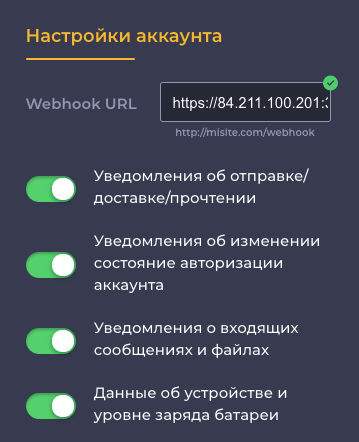

# Получение уведомлений через Webhook Endpoint

Технология Webhook Endpoint позволяет выполнять получение входящих уведомлений непосредственно на ваш сервер. Это означает, что сервер Green API будет выполнять вызов метода, опубликованного на стороне вашего сервера. Преимуществами данной технологии является максимально быстрое получение входящих уведомлений и высокая пропускная способность, ограниченная только скоростью обработки уведомлений на стороне вашего сервера. К недостаткам можно отнести сложность реализации. 

> Сервер Green API выполняет 5 попыток доставки уведомлений с увеличенным интервалом. Поэтому, настраивайте свой сервер таким образом, чтобы он всегда был доступен для обработки входящих уведомлений, либо воспользуйтесь технологией [Получение уведомлений через HTTP API](technology-http-api.md), в которой доставка входящих уведомлений гарантируется в течение 24 часов.

## Настройка сервера

Для получения входящих уведомлений по технологии Webhook Endpoint потребуется выполнить следующие шаги:

- опубликовать IP-адрес в Интернете
- реализовать логику обработки входящих уведомлений на указанный IP-адрес
- если тебуется для сервера, то установить Webhook URL Token

### Публичный IP-адрес

Для получения входящих уведомлений требуется наличие публичного IP-адреса (endpoint), который будет доступен из сети Интернет. Таким образом сервер Green API сможет выполнить вызов вашего сервера по указанному адресу и передать входящее уведомление.

### Обработка входящих уведомлений

После получения входящего вызова на IP-адрес вашего сервера потребуется выполнить обработку полученного уведомления. Пример кода обработки входящго уведомления на [NodeJS](https://nodejs.org) можно посмотреть в [файле](https://github.com/green-api/whatsapp-api-client/blob/master/examples/ReceiveWebhook.js)

## Настройка аккаунта {#webhookUrl}

Перед получением входящих уведомлений требуется выполнить настройку аккаунта. Настройка аккаунта может быть выполнена [программно](#SetSettings) с использованием метода [SetSettings](../account/SetSettings.md), либо [интерактивно](#cabinet) в интерфейсе личного кабинета.

### Настройка методом [SetSettings](../account/SetSettings.md) {#SetSettings}

Для настройки получения входящих уведомлений по технологии Webhook Endpoint требуется указать в качестве параметра `webhookUrl` значение вашего IP-адреса или вашего доменного имени, и, если необходимо, `webhookUrlToken` для доступа на ваш сервер. Например:

```
https://84.211.100.201:3000/green-api/webhook/
```

Также требуется указать какие виды уведомлений необходимо получать. Для включения входящих уведомлений по видам, а также для указания параметра `webhookUrl` и `webhookUrlToken` воспользуйтесь методом [SetSettings](../account/SetSettings.md).

#### Пример тела запроса метода [SetSettings](../account/SetSettings.md)

```json
{
    "webhookUrl": "https://84.211.100.201:3000/green-api/webhook/",
    "webhookUrlToken": "dscnsdiuafkascndjhsalbcvatsvcbasn23rfregvfdg54tds",
    "outgoingWebhook": "yes",
    "stateWebhook": "yes",
    "incomingWebhook": "yes",
    "deviceWebhook": "no"
}
```

### Настройка в личном кабинете {#cabinet}

Настройку получения входящих уведомлений можно также выполнить интерактивно. Для этого перейдите в [Личный кабинет](https://cabinet.green-api.com) и выберите требуемый аккаунт. Если аккаунт авторизован, то будут отображены настройки для получения входящих уведомлений см. рис. Укажите значение параметра `webhookUrl`, а также переключатели по видам уведомлений и, если необходима авторизация на вашем вебхук сервере, Webhook URL Token. Если аккаунт не авторизован и настройки уведомлений не отображаются, обратитесь к разделу [Перед началом работы](../../before-start.md#qr).



## Получение входящих уведомлений

После выполнения настройки аккаунта можно приступать к получению уведомлений. Пример кода обработки входящго уведомления на [NodeJS](https://nodejs.org) можно посмотреть в [файле](https://github.com/green-api/whatsapp-api-client/blob/master/examples/ReceiveWebhook.js).

## Отладка входящих уведомлений

Для отладки входящих уведомлений можно использовать любой бесплатный сервис в Интернет, например сервис [Webhook.Site](https://webhook.site/). Сервис выдает уникальный адрес (URL), который требуется [установить](#webhookUrl) в качестве значения параметра `webhookUrl`.

Подробное описание формата входящих уведомлений представлено в разделе [Формат входящих уведомлений](notifications-format/index.md).